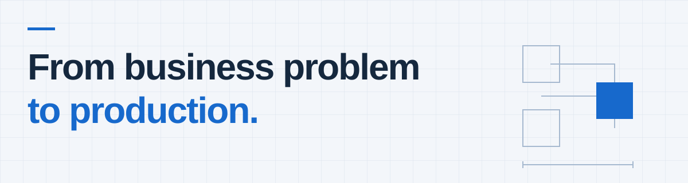

# Serhii Slepokurov

**Principal Developer · Full-Stack Engineer · Applied AI**

I work across .NET backends, web interfaces, and cloud infrastructure. **17+ years** of software engineering across the **US, Europe, and MENA**, with plenty of time spent following a problem across those boundaries.

<picture>
  <source media="(max-width: 600px) and (prefers-color-scheme: dark)" srcset="./assets/engineering-dark-mobile.svg">
  <source media="(max-width: 600px)" srcset="./assets/engineering-light-mobile.svg">
  <source media="(prefers-color-scheme: dark)" srcset="./assets/engineering-dark.svg">
  
</picture>

## Notes from between the boxes

<b>01 / “200 OK.” Did the work happen?</b>

A successful HTTP response can still contain a failed business operation. I follow the request through the integration and check the result that the person using the software actually needed.

<b>02 / What does “try again” actually repeat?</b>

A retry can mean a second email or the same operation twice. I look for idempotency, ordering, shared state, and a way to recover without guessing.

<b>03 / Where should automation stop?</b>

An AI draft can be fluent and still be the wrong next move. Conversation context, a refusal, or a person already handling the conversation should change what happens next. Evaluation and human review belong in the workflow.

## Working materials

- **Backend:** C#, .NET, ASP.NET Core, Node.js, REST APIs, microservices.
- **Frontend:** TypeScript, JavaScript, Angular, React.
- **Cloud and data:** Azure, AWS, Docker, SQL Server, PostgreSQL, Redis.
- **Applied AI:** OpenAI API, Anthropic API, large language models (LLMs), generative AI, workflow automation.
- **Engineering practice:** software architecture, CI/CD, automated testing, observability, production diagnostics, mentoring.

---

Much of my production work lives in private repositories. More about the projects and career: **[LinkedIn](https://www.linkedin.com/in/slepokurov/)**.

