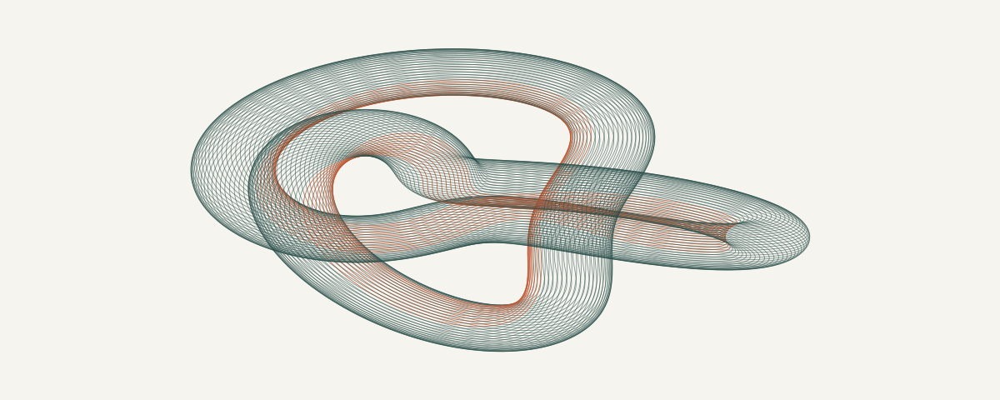

<picture>
  <source media="(max-width: 600px) and (prefers-color-scheme: dark)" srcset="./assets/continuity-dark-mobile.svg">
  <source media="(max-width: 600px)" srcset="./assets/continuity-light-mobile.svg">
  <source media="(prefers-color-scheme: dark)" srcset="./assets/continuity-dark.svg">
  
</picture>

Continuity · (2, 3) torus knot · <a href="./tools/draw-knot.py">Drawn with code ↗</a>

# Serhii Slepokurov

**Principal Developer · Full-Stack Engineer · Applied AI**

Applied mathematics by education. Software engineering for **17+ years**, across the **US, Europe, and MENA**. My work spans .NET backends, web interfaces, cloud infrastructure, and AI in production workflows.

**Backend** · C# / .NET / ASP.NET Core / Node.js / REST APIs / microservices 
**Frontend** · TypeScript / JavaScript / Angular / React 
**Cloud & data** · Azure / AWS / Docker / SQL Server / PostgreSQL / Redis 
**Applied AI** · OpenAI API / Anthropic API / LLMs / workflow automation 
**Practice** · Architecture / CI/CD / automated testing / observability / mentoring

Most of my production work is private. **[Career & experience ↗](https://www.linkedin.com/in/slepokurov/)**
